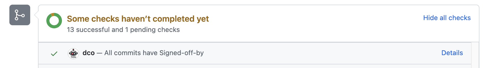

# dco (Developer Certificate of Origin)

## 设计背景

> DCO 是 [Developer Certificate of Origin](https://developercertificate.org/) 的缩写，由 Linux Foundation 于 2004 年制定。相比签署 CLA 协议，贡献者不需要阅读冗长的法律条文，只需要在提交代码时在 commit message 中以 `Signed-off-by: Full Name <fullname@example.com>` 格式签署邮件地址即可，减轻开发者贡献的阻碍。


为了能够确保代码贡献者在提交 Pull Request 时对所有的 commit 都进行了签署，开源仓库的管理者通常会通过 CI 检查或 GitHub Bot 来对 PR 的所有 commit 进行检查。

例如：被广泛用于 DCO 检查的 [probot/dco](https://github.com/probot/dco) 机器人。但是不幸的是，DCO 机器人的原创团队已经不再继续维护该项目 ( [probot/dco#162](https://github.com/probot/dco/issues/162#issuecomment-941149056) )，GitHub 方面也关闭了该 Probot App 的服务器，想要继续使用该 Probot App 则需要自行部署。

作为替代方案，我们可以在已经部署了 TiChi 的仓库上直接开启 dco 插件来实现同等的检查功能。

## 设计思路

贡献者可以在提交 Commit 的命令行当中添加 `-s` 参数，git 命令将会自动添加上签署信息。

```bash
git commit -s -m 'This is my commit message'
```

```bash
This is my commit message

Signed-off-by: Random <random@example.com>
```

当贡献者通过 PR 的方式提交代码时，机器人会对提交的 commit 进行检查，如果发现其中一个 commit 的 commit message 部分没有带有 `Signed-off-by: ` 字段，机器人将会通过评论列举出没有签署信息的 commit 列表。

贡献者可以通过 [`git commit --amend`](https://docs.github.com/en/github/committing-changes-to-your-project/creating-and-editing-commits/changing-a-commit-message) 等方式对 commit 进行重新签署。

当所有的 commit 都已经签署后，机器人会将 `dco` 的状态变成通过状态。 



## 参数配置

可以通过配置跳过对 Org 成员或协作者的 DCO 检查。

```yaml
dco:
    org/repo:
        # 跳过对项目协作者的 DCO 检查
        skip_dco_check_for_collaborators: true
        # 跳过对项目成员的 DCO 检查
        skip_dco_check_for_members: true
        # 指定 Org 的成员可以跳过 DCO 检查，当 skip_dco_check_for_members 选项开启时，默认跳过当前仓库所在组织的成员
        trusted_org: org
```

一般情况下，使用 DCO 协议的开源仓库都会将 PR 中所有 commit 必须都经过签署作为 PR 合并的必要条件之一。要想实现该功能，可以利用 GitHub 的分支保护机制，将 `dco` 这个 Status 作为 [Required Context Status](https://docs.github.com/en/repositories/configuring-branches-and-merges-in-your-repository/defining-the-mergeability-of-pull-requests/about-protected-branches#require-status-checks-before-merging) 。

在 TiDB 社区当中，我们使用 [branchprotector](components/branchprotector.md) 组件来对分支保护进行管理，可以在启动 dco 插件的同时，将 `dco` 添加到对应仓库的 [`required_status_checks`](https://github.com/ti-community-infra/configs/blob/main/prow/config/config.yaml#:~:text=branch-protection) 配置项当中，机器人将会在 PR 合并后的 *半小时* 内自动地将仓库分支保护设置好。

```yaml
branch-protection:
  orgs:
    ti-community-infra:
      repos:
        test-dev:
          branches:
            master:
              protect: true
              required_status_checks:
                contexts:
                  - "dco"
                  # other status check...
```

## 参考文档

- [dco doc](https://prow.tidb.io/plugins?repo=ti-community-infra%2Ftichi)
- [代码实现](https://github.com/kubernetes/test-infra/tree/master/prow/plugins/dco)
